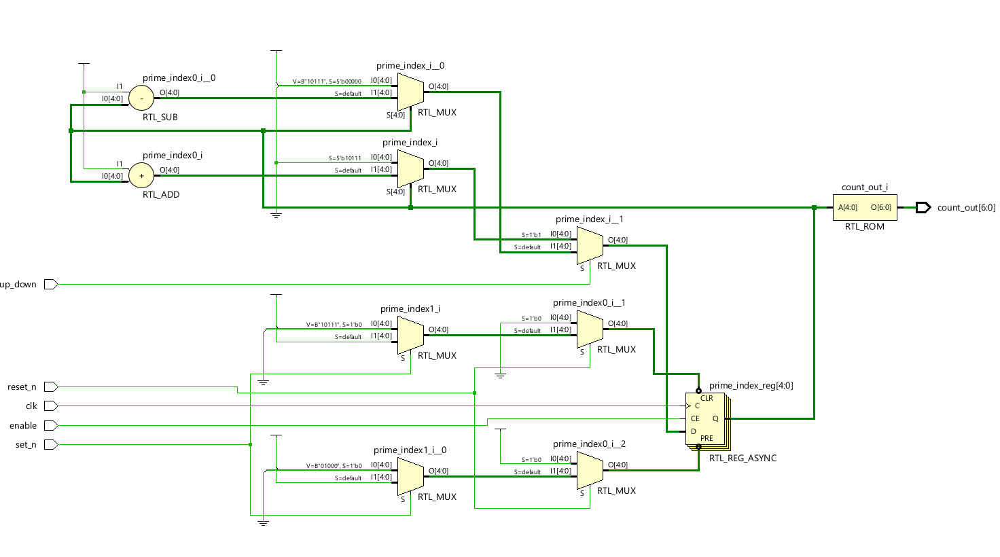
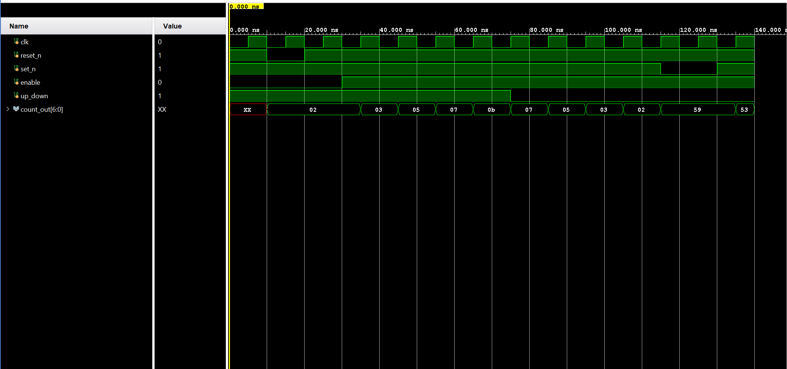

# Verilog Prime Number Counter

This repository contains the Verilog source code for an asynchronous up/down counter that cycles through the sequence of prime numbers up to 95.

This project was designed and verified using Vivado 2024.2.

---

## Key Features

-   **Prime Sequence:** Counts through the 24 prime numbers from 2 to 89.
-   **Up/Down Control:** A single input `up_down` controls the direction of the count.
-   **Asynchronous Controls:** Features an active-low asynchronous reset (to 2) and an active-low asynchronous set (to 89).
-   **Gated Clock:** An `enable` signal allows for pausing and resuming the count.

---

## Design Approach

Instead of calculating primality in real-time, which is inefficient in hardware, this design uses a highly optimized **Look-Up Table (LUT)** approach. A simple 5-bit index counter points to the current prime number stored in a combinational ROM, which is synthesized from a `case` statement. This results in a fast and resource-efficient circuit.

---

## Verification

The module was verified with a comprehensive testbench.

### RTL Schematic
This schematic shows the synthesized logic, including the index register, next-state logic, and the output ROM.

*
RTL Schematic
*

### Simulation Waveform
This waveform demonstrates the reset, set, up-counting, down-counting, and enable functionalities.

*
Simulation Waveform
*

---

## Files

-   `prime_counter.v`: The synthesizable Verilog module.
-   `testbench.v`: The Verilog testbench used for verification.
